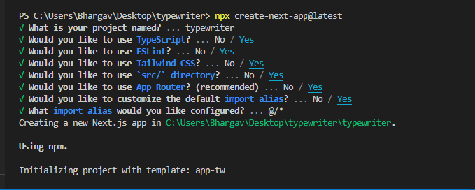

<p align="center">
  
</p>
  
 
# 

I make custom typewriter effect in next.js 13. i tried to use typewriter-effect but throwing me error.
and i am noob at react and webdev. if you find any bug feel free to rise issue or create pr.

# Installation

config i used
<p align="center">
  
</p>

clone repo in your Directory
```
git clone https://github.com/Bhargavoza1/typewriter-next.js13.git
```

open project in vs code 
``` 
cd typewriter-next.js13

code .
```

install all dependencies
```
npm install
```

start your development server
```
npm run dev
```
watch typewriter effect on web browser by copy pasting below link.
http://localhost:3000


# code 

## Typewriter.tsx
```typescript

'use client'

import React, {useState, useEffect, useRef} from 'react';

function Typewriter({
                        textclass,
                        cursorclass,
                        text = "HELLO,WORLD",
                        writeDelay = 100,
                        readDelay = 1000,
                        eraseDelay = 70,
                    }: {
    textclass: string;
    cursorclass: string;
    text: string;
    writeDelay: number;
    readDelay: number;
    eraseDelay: number;
}) {
    const sentences = text.split(',').map((value: string) => value.trim());

    const [currentText, setCurrentText] = useState('');
    const [isTyping, setIsTyping] = useState(true);
    const [charIndex, setCharIndex] = useState(0);
    const  sentenceIndex  = useRef(0);

    useEffect(() => {
        let timeout: NodeJS.Timeout;

        const typeNextCharacter = () => {
            if (isTyping) {
                if (charIndex < sentences[sentenceIndex.current].length) {//write character per delay
                    setCurrentText((prevText) => prevText + sentences[sentenceIndex.current][charIndex]);
                    setCharIndex((prevCharIndex) => prevCharIndex + 1);
                } else {//wait for some delay for ppl to read it.then it will start revers order
                    timeout = setTimeout(() => {
                        setIsTyping(false);
                    }, readDelay);
                }
            } else {
                if (currentText.length > 0) {//reverse. erasing one character per delay
                    setCurrentText((prevText) => prevText.slice(0, -1));
                } else {// reset or pick next sentence
                    setIsTyping(true);
                    setCharIndex(0);
                    sentenceIndex.current =(sentenceIndex.current + 1) % sentences.length; //this will help not to use one more if else
                    setCurrentText('');
                }
            }
        };

        timeout = setTimeout(typeNextCharacter, isTyping ? writeDelay : eraseDelay);

        return () => clearTimeout(timeout);
    }, [currentText, isTyping]);

    return (
        <>
            <span className={`${textclass}`}>{currentText}</span>
            <span
                className={`${cursorclass } box-border inline-block w-0.5 md:w-1 h-7 md:ml-1 -mb-1.5 md:-mb-4 md:h-16 animate-typing will-change-transform`}
            ></span>
        </>
    );
}

export default Typewriter;

```

## page.tsx
use comma after every sentence to separate it.
example
1) text="WORLD!,GOOD DAY"
2) text="developer,designer,engineers"

```typescript

import Typewriter from '@/components/Typewriter'
 
export default function Home() {
  return (
    <div
    className='   content-center   items-center justify-center grid     place-items-center '>
        <h1 className='text-xl md:text-5xl '>
        HELLO,&nbsp;
        <Typewriter textclass='text-[#1b96f3]' cursorclass='bg-[#1b96f3]'
                    text="WORLD!,GOOD DAY"
                    writeDelay={120} readDelay={1000} eraseDelay={70}/>
        </h1>
    </div>
  )
}
```

